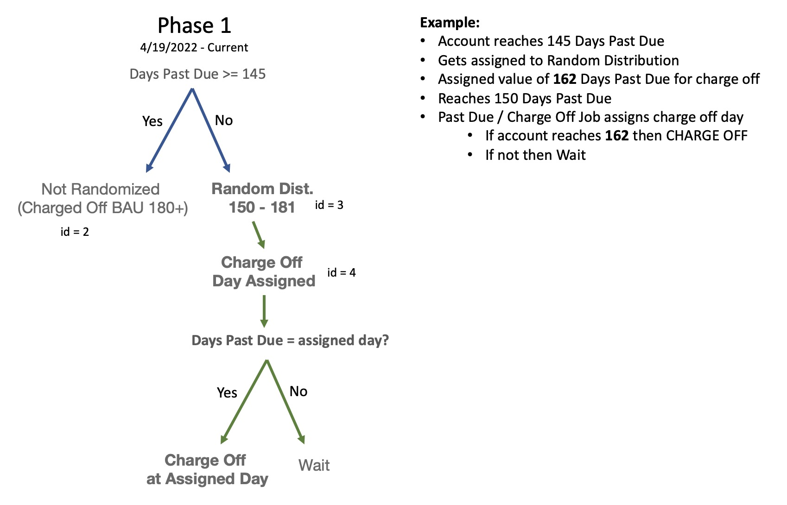

```{r setup, include=FALSE, message=FALSE}
{
  library(dplyr)
  library(snapdragon)
  library(highcharter)
  library(lubridate)
  library(reshape2)
  library(magrittr)
  library(reactable)
  library(pins)
  library(ggplot2)
  library(plotly)
  library(readr)
  library(tidyr)
  library(htmlwidgets)
  library(manipulateWidget)
  opts <- getOption("highcharter.lang")
  opts$thousandsSep <- ","
  options(highcharter.lang = opts)
}

cot_pin <- list()
cot_pin$paid <- read_csv("paid.csv") %>% 
  mutate(
    # application_id2 = paste0(as.numeric(parse_number(application_id)) * 8, str_extract(application_id, regex("[a-z]+", ignore_case = T)))
    application_id = row_number()
    , item_int = item_int * 9
  )
cot_pin$paid_cod <- read_csv("paid_cod.csv") %>% 
  mutate(
    # application_id2 = paste0(as.numeric(parse_number(application_id)) * 8, str_extract(application_id, regex("[a-z]+", ignore_case = T)))
    application_id = row_number()
    , item_int = item_int * 9
  )
cot_pin$cot <- read_csv("cot.csv")
cot_pin$distr <- read_csv("distr.csv")
cot_pin$rec_co <- read_csv("rec_co.csv")

```

## Phase 1



### Project Details

-   Project name = "Settlement-chargeoff"

-   Project id = 2

-   instance_id = 2 and 3

-   version_id = 2 and 3

-   treatment_detail_id = 4 for random distr dpd (3 for not yet 145 etc)

## Observations

```{r query for observations, echo=FALSE, warning=FALSE, message=FALSE}
# project_id = 2 
# instance_id = 2 = random split 3 = random charge off
# version id = 2 or 3 (3 is 150-180)
# treatment_detail_id = 2 is >= 145, 3 is < 145, 4 is rand dist

c1 <- sd_highchart('stock') %>% 
  sdhc_title("Daily Observations by Treatment") %>%
  hc_add_series_list(
    cot_pin$cot %>% 
      mutate(name = name) %>% 
      group_by(type='line', name = paste0(name, " id:", treatment_detail_id)) %>% 
      arrange(observe_dt) %>% 
    do(data=list_parse(
      data.frame(
      x=datetime_to_timestamp(.$observe_dt), y=.$accounts
      )
    ))
  ) %>% 
  hc_legend(
    enabled=T
  ) %>% 
  hc_navigator(enabled=FALSE) %>%
  hc_rangeSelector(enabled=FALSE) %>%
  hc_scrollbar(enabled=FALSE)

c2 <- sd_highchart('stock') %>% 
  sdhc_title("Cuml Observations by Treatment") %>%
  hc_add_series_list(
    cot_pin$cot %>% 
      mutate(name =name) %>% 
      group_by(type='line', name = paste0(name, " id:", treatment_detail_id)) %>% 
      mutate(total = cumsum(accounts)) %>% 
      arrange(observe_dt) %>% 
    do(data=list_parse(
      data.frame(
      x=datetime_to_timestamp(.$observe_dt), y=.$total
      )
    ))
  ) %>% 
  hc_legend(
    enabled=T
  ) %>% 
  hc_navigator(enabled=FALSE) %>%
  hc_rangeSelector(enabled=FALSE) %>%
  hc_scrollbar(enabled=FALSE)

combineWidgets(c1,c2,nrow=1)
```

## Accounts by Random Charge Off Value
```{r distr, echo=FALSE, warning=FALSE, message=FALSE}

hchart(
  density(cot_pin$distr$charge_off_value), 
  type = "area", name = "Charge Off Value"
  ) %>% 
  hc_title(text="Distribution of Charge Off Day Assignments")

```

## Number of Observations and Charge Offs by Tranche
```{r table by tranche, echo=FALSE, warning=FALSE, message=FALSE}
cot_pin$distr %>% 
  mutate(
    tranche = case_when(
      charge_off_value >= 150 & charge_off_value <= 159 ~ '150-159',
      charge_off_value >= 160 & charge_off_value <= 169 ~ '160-169',
      charge_off_value >= 170 & charge_off_value <= 180 ~ '170-180'
    ),
    item_int
  ) %>% 
  group_by(tranche) %>% 
  summarise(
    accounts = n(),
    charged_off = n_distinct(item_int[!is.na(charge_off_dt)&charge_off_dt>=observation_dt]),
    pct = charged_off / accounts
  ) %>% 
  reactable(
    striped = T,
    width = 400,
    defaultColDef = colDef(format=colFormat(separators = T)),
    columns = list(
      pct = colDef(format=colFormat(percent=T, digits = 2))
    )
  )
```

## Tranches Paid performance at 35, 50, 65, 80 days since treatment_dt
only accts that have been charged off
```{r time query, echo=FALSE, warning=FALSE, message=FALSE}
cot_pin$paid %>% 
  filter(
    treatment_name == "charge_off_day" #& paid_delta != 0
    & !is.na(charge_off_dt)
  ) %>% 
  mutate(
    paid_delta = paid_amt1 - paid_amt0,
    tranche = case_when(
      charge_off_value >= 150 & charge_off_value <= 159 ~ '150-159',
      charge_off_value >= 160 & charge_off_value <= 169 ~ '160-169',
      charge_off_value >= 170 & charge_off_value <= 180 ~ '170-180'
    ),
    paid_something = ifelse(paid_delta > 0, 1, 0)
    # trim top and bottom 5% of paid_delt
  ) %>% 
  filter(paid_delta>=0) %>% #only 16 occurences with chargeback etc.
  group_by(age, tranche) %>% 
  summarise(
    accounts=n(),
    charged_off_accts = n_distinct(item_int[!is.na(charge_off_dt)]),
    paid = sum(paid_delta),
    paid_accts = n_distinct(application_id[paid_delta>0]),
    avg_paid = mean(paid_delta),
    paid_something_rate = round((sum(paid_something)/accounts)*100, 2)#,
    # avg_paid_trim = mean(paid_delta, trim = 0.05),
    # charged_off = n_distinct(application_id[!is.na(charge_off_dt)]),
    # charged_off_at_value = n_distinct(application_id[!is.na(charge_off_dt)&charge_off_value>0&charge_off_value<=new_days_past_due1])      
  ) %>% 
  reactable(
    striped = T,
    # width = 800,
    pagination = F,
    height = 400,
    columns = list(
      age = colDef(width = 50, sticky="left",style = list(borderRight = "1px solid #eee")),
      tranche = colDef(width = 75, sticky="left",style = list(borderRight = "1px solid #eee")),
      accounts = colDef( format = colFormat(separators = T), sticky="left",style = list(borderRight = "1px solid #eee")),
      # charged_off_accts = colDef( format = colFormat(separators=T)),
      paid = colDef( format = colFormat(prefix="$", digits = 0, separators = T)),
      avg_paid = colDef( format = colFormat(currency="USD", digits = 2, separators = T)),
      paid_something_rate = colDef( format =colFormat(suffix='%', digits = 2))
      # avg_paid_trim = colDef( format = colFormat(currency="USD", digits = 2, separators = T)),
      # charged_off = colDef( format = colFormat(separators = T)),
      # charged_off_at_value = colDef( format = colFormat(separators = T))
    )
  )

```

## Paid vs Charge-Off Days Past Due (65)
```{r p dens, echo=FALSE}
  highchart() %>% 
  sdhc_title("Paid vs Charge Off Days Past Due") %>% 
  sdhc_subtitle('65 days after treatment') %>% 
  hc_add_series(
    cot_pin$paid %>% 
      filter(paid_delta >= 0 
             & age == 65
             & !is.na(charge_off_dt) # show only accounts that charged off
      ),
    type = 'scatter', hcaes(x= charge_off_value, y=paid_delta)
  ) %>% 
  hc_xAxis(
    title = list(text="Days Past Due")
  ) %>% 
  hc_yAxis(
    title = list(text="Paid Amt")
  ) %>% 
  hc_legend(enabled = FALSE)
    
```

## Tranches Paid performance at 35, 50, 65, 80 days since charge_off_dt
```{r paid cod, echo=FALSE, message = FALSE}
cot_pin$paid_cod %>% 
  filter(
    treatment_name == "charge_off_day" #& paid_delta != 0
  ) %>% 
  mutate(
    paid_delta = paid_amt1 - paid_amt0,
    tranche = case_when(
      charge_off_value >= 150 & charge_off_value <= 159 ~ '150-159',
      charge_off_value >= 160 & charge_off_value <= 169 ~ '160-169',
      charge_off_value >= 170 & charge_off_value <= 180 ~ '170-180'
    ),
    paid_something = ifelse(paid_delta > 0, 1, 0)
    # trim top and bottom 5% of paid_delt
  ) %>% 
  filter(paid_delta>=0) %>% #only 16 occurences with chargeback etc.
  group_by(age, tranche) %>% 
  summarise(
    accounts=n(),
    charged_off_accts = n_distinct(item_int[!is.na(charge_off_dt)]),
    paid = sum(paid_delta),
    paid_accts = n_distinct(application_id[paid_delta>0]),
    avg_paid = mean(paid_delta),
    paid_something_rate = round((sum(paid_something)/accounts)*100, 2)#,
    # avg_paid_trim = mean(paid_delta, trim = 0.05),
    # charged_off = n_distinct(application_id[!is.na(charge_off_dt)]),
    # charged_off_at_value = n_distinct(application_id[!is.na(charge_off_dt)&charge_off_value>0&charge_off_value<=new_days_past_due1])      
  ) %>% 
  reactable(
    striped = T,
    # width = 800,
    pagination = F,
    height = 400,
    columns = list(
      age = colDef(width = 50, sticky="left",style = list(borderRight = "1px solid #eee")),
      tranche = colDef(width = 75, sticky="left",style = list(borderRight = "1px solid #eee")),
      accounts = colDef( format = colFormat(separators = T), sticky="left",style = list(borderRight = "1px solid #eee")),
      # charged_off_accts = colDef( format = colFormat(separators=T)),
      paid = colDef( format = colFormat(prefix="$", digits = 0, separators = T)),
      avg_paid = colDef( format = colFormat(currency="USD", digits = 2, separators = T)),
      paid_something_rate = colDef( format =colFormat(suffix='%', digits = 2))
      # avg_paid_trim = colDef( format = colFormat(currency="USD", digits = 2, separators = T)),
      # charged_off = colDef( format = colFormat(separators = T)),
      # charged_off_at_value = colDef( format = colFormat(separators = T))
    )
  )
```

## Paid vs Charge-Off Days Past Due (65)
```{r p dens cod, echo=FALSE}
  highchart() %>% 
  sdhc_title("Paid vs Charge Off Days Past Due") %>% 
  sdhc_subtitle('65 days after charge_off_dt') %>% 
  hc_add_series(
    cot_pin$paid_cod %>% 
      filter(paid_delta >= 0 
             & age == 65
             & !is.na(charge_off_dt) # show only accounts that charged off
      ),
    type = 'scatter', hcaes(x= charge_off_value, y=paid_delta)
  ) %>% 
  hc_xAxis(
    title = list(text="Days Past Due")
  ) %>% 
  hc_yAxis(
    title = list(text="Paid Amt")
  ) %>% 
  hc_legend(enabled = FALSE)
    
```

```{r dens table helper, echo=FALSE, eval=FALSE}
## Paid Amt Density (30)
# look at negative paid_delta impact
cot_pin$paid %>% 
  filter(
    age == 35 
  ) %>% 
  mutate(
    tranche = case_when(
      charge_off_value >= 150 & charge_off_value <= 159 ~ '150-159',
      charge_off_value >= 160 & charge_off_value <= 169 ~ '160-169',
      charge_off_value >= 170 & charge_off_value <= 180 ~ '170-180'
    ),
    paid_delta_grp = case_when(
      paid_delta == 0 ~ 'Zero', 
      paid_delta < 0 ~ 'Neg',
      TRUE ~ 'Pos')
  ) %>% 
  group_by(tranche, paid_delta_grp) %>% summarise(accts=n(), sum_paid_delta = sum(paid_delta)) %>% reactable()
```

## How much $ is collected after 14 days in Recovery?
```{r reg, echo=FALSE, message=FALSE}

# get recovery paid amt
  cot_pin$rec_co %>%
  filter(
    !is.na(primary_placed_dt) # show only placed accts
    & primary_placed_dt >= observation_dt # there were some accounts placed before entering the experiment
    & days_in_recovery >= 14 
  ) %>% 
  mutate(
    tranche = case_when(
        charge_off_value >= 150 & charge_off_value <= 159 ~ '150-159',
        charge_off_value >= 160 & charge_off_value <= 169 ~ '160-169',
        charge_off_value >= 170 & charge_off_value <= 180 ~ '170-180'
      ),
    paid_something = ifelse(paid_after_placement > 0, 1, 0)
  ) %>% 
  # group_by(primary_placed_dt, tranche) %>% 
  # summarise(n=n()) %>% 
  # View()  
  group_by(
    tranche#, days_in_recovery
  ) %>% 
  summarise(
    placed_accts = n_distinct(item_int),
    paid_accts = n_distinct(item_int[paid_something==1]),
    paid_total = sum(paid_after_placement),
    paid_something_rate = mean(paid_something),
    avg_paid = mean(paid_after_placement),
    med_paid = median(paid_after_placement, na.rm=T)
  ) %>% 
  reactable(
    striped = T,
    width = 800,
    pagination = F,
    height = 200,
    columns = list(
      tranche = colDef(width = 75),
      placed_accts = colDef( format = colFormat(separators = T)),
      paid_accts = colDef( format = colFormat(separators = T)),
      paid_total = colDef( format = colFormat(prefix="$", digits = 0, separators = T)),
      paid_something_rate = colDef( format = colFormat(percent = TRUE, digits = 2)),
      avg_paid = colDef( format = colFormat(currency="USD", digits = 2, separators = T))
    )
  )
  
```

## Paid vs Charge Off Days Past Due 
```{r recov paid scatter, echo=FALSE}
  # create a scatter plot of paid and dpd charge off
  highchart() %>% 
    sdhc_title('Paid After 14 days in Recovery') %>% 
    hc_add_series(
      cot_pin$rec_co %>% #head(400) %>% 
        filter(
          !is.na(primary_placed_dt) # show only placed accts
          & primary_placed_dt >= observation_dt # there were some accounts placed before entering the experiment
          & days_in_recovery >= 14 
          ),
      type = 'scatter',hcaes(x=charge_off_value, y=paid_after_placement, color = snap_blue_med)
    ) %>% 
    hc_xAxis(
      title = list(text="Days Past Due")
    ) %>% 
    hc_yAxis(
      title = list(text="Paid After Placement")
    ) %>% 
    hc_legend(enabled = FALSE)
```


